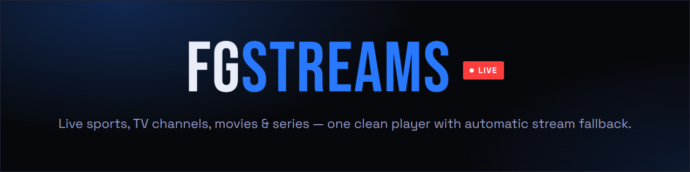
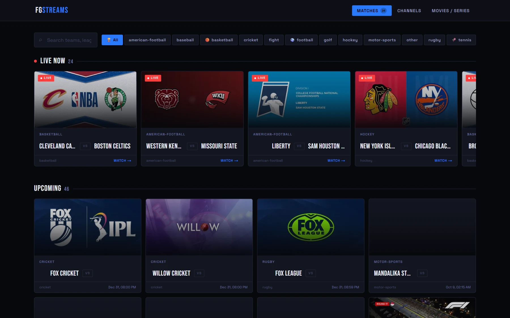
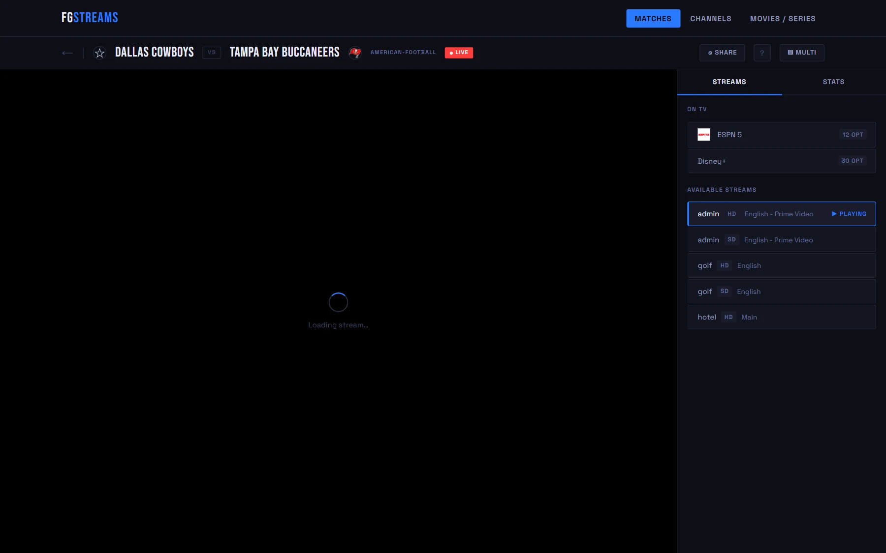
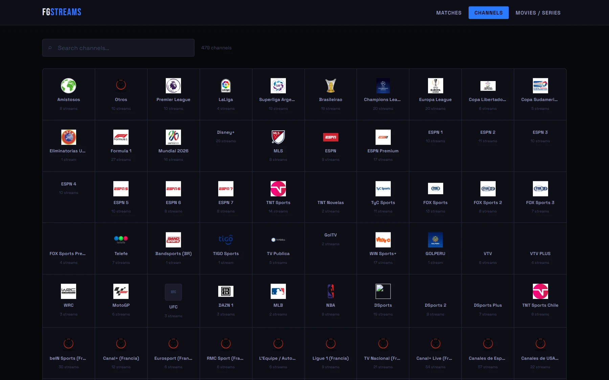
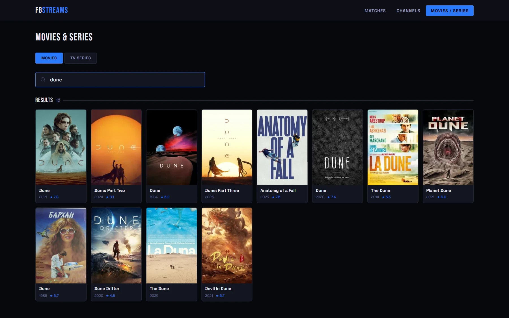
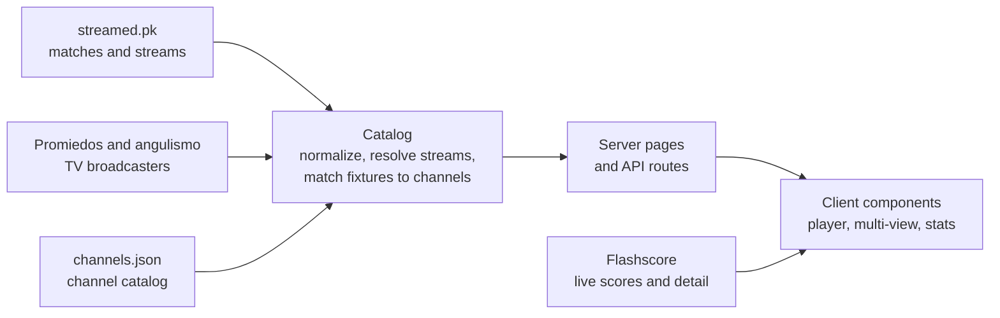

<div align="center">



<br>

[](https://github.com/fedegualdrini/fgstreams3/actions/workflows/ci.yml)
[](LICENSE)
[](https://nextjs.org)
[](https://www.typescriptlang.org)
[](https://tailwindcss.com)

**[Live demo](https://fgstreams3.vercel.app)** · [Architecture](docs/ARCHITECTURE.md) · [Project structure](docs/PROJECT_STRUCTURE.md) · [Contributing](CONTRIBUTING.md)

</div>

---

FGStreams lists what is live right now, finds a playable source for it, and keeps playing when a source fails. Matches, TV channels, and movies and series share one fast, clutter-free interface.

<p align="center">
  
</p>

## Features

| | |
|---|---|
| **Only matches you can watch** | Stream endpoints are resolved server-side before render. A match with no working stream and no TV channel carrying it is never listed. |
| **Automatic stream fallback** | When a stream fails to load, the player rotates to the next untried one. If all fail, **Try Again** refetches. The best stream is picked by language, quality and source order. |
| **TV channel detection** | Fixtures are matched against [Promiedos](https://www.promiedos.com.ar) and the angulismo feed to find the broadcaster, then resolved against the local channel catalog (ESPN Premium, TNT Sports, ...). The channel shows as a playable source and a badge on the card. |
| **Multi-match view** | Watch up to four matches at once, with per-stream mute, remove and source switching. |
| **Live scores and stats** | Polled scores and minute on cards. Match pages add events, statistics and lineups when available (Flashscore-backed). |
| **Search and filters** | Filter by team, league or sport, with quick sport buttons. |
| **Watch history** | Recently watched matches are kept in local storage and shown on the home page. |
| **Channels** | A searchable catalog of hundreds of channels. The selected channel and source live in the URL, with retry and next-option controls. HLS and DASH (ClearKey) play natively. |
| **Movies and series** | TMDB-backed search, embedded playback, and season/episode selection for TV. |
| **Keyboard shortcuts** | `N` next stream, `F` fullscreen, `?` shortcut help. |

## Screenshots

<table>
  <tr>
    <td width="33%"><a href="docs/screenshots/match.webp"></a></td>
    <td width="33%"><a href="docs/screenshots/channels.webp"></a></td>
    <td width="33%"><a href="docs/screenshots/movies.webp"></a></td>
  </tr>
  <tr>
    <td align="center"><sub><b>Match page</b>: TV channels and fallback sources</sub></td>
    <td align="center"><sub><b>Channels</b>: searchable catalog</sub></td>
    <td align="center"><sub><b>Movies &amp; series</b>: TMDB search</sub></td>
  </tr>
</table>

## Quick start

Requires Node.js 20.19+ (22 recommended).

```bash
git clone https://github.com/fedegualdrini/fgstreams3.git
cd fgstreams3
npm install
npm run dev
```

Open [http://localhost:3000](http://localhost:3000).

### Environment

Sports matches and channels need no configuration. Create `.env.local` for the rest:

```bash
TMDB_API_KEY=your_tmdb_api_key          # movie and TV search
HLS_PROXY_SECRET=any_long_random_string # signs the URLs /api/hls-proxy hands back
```

Set `HLS_PROXY_SECRET` in production so nobody else can produce valid proxy signatures.

### Commands

| Command | What it does |
|---|---|
| `npm run dev` | Start the development server |
| `npm run build` / `npm start` | Build and serve the production app |
| `npm test` / `npm run test:watch` | Run the Vitest suite once / in watch mode |
| `npm run lint` | Next.js linting |
| `npm run typecheck` | `tsc --noEmit` |
| `npm run import:playlist -- <playlist.json>` | Merge an external channel playlist ([guide](docs/CHANNEL_IMPORT.md)) |

## How it works



streamed.pk, Promiedos and the angulismo feed are combined into one cached catalog (`lib/catalog.ts`), then served to the pages and API routes. Only the match feed is mandatory: the other sources degrade to "no extra data", and an empty upstream response is never cached. See [docs/ARCHITECTURE.md](docs/ARCHITECTURE.md) for the full walkthrough.

## Tech stack

- **[Next.js 14](https://nextjs.org)** (App Router), **React 18**, **TypeScript** in strict mode
- **Tailwind CSS** plus a small set of shared CSS primitives (`.btn`, `.kbd`, `.status-panel`)
- **[hls.js](https://github.com/video-dev/hls.js)** and **[Shaka Player](https://github.com/shaka-project/shaka-player)** for HLS and DASH playback
- **[Zod](https://zod.dev)** to validate every upstream response
- **Vitest** and Testing Library for tests; GitHub Actions for CI

## Data sources

| Source | Used for |
|---|---|
| [streamed.pk](https://streamed.pk) | Matches, live flags, per-match streams, images |
| [Promiedos](https://www.promiedos.com.ar) | Fixture broadcasters, read from the page's `__NEXT_DATA__` |
| angulismotv feed | Channel catalog and fixture-to-channel mapping with playable URLs |
| Flashscore (mobile pages) | Live scores and match detail, through local API routes |
| [TMDB](https://www.themoviedb.org) | Movie and TV metadata (needs `TMDB_API_KEY`) |
| `public/channels.json` | Local channel catalog |

## Documentation

- [Architecture](docs/ARCHITECTURE.md): data flow from the upstream feeds to the screen
- [Project structure](docs/PROJECT_STRUCTURE.md): every folder and module, plus coding conventions
- [Channel import](docs/CHANNEL_IMPORT.md): merging an external playlist into the catalog
- [Contributing](CONTRIBUTING.md): setup, checks and conventions

## Disclaimer

FGStreams does not host, upload or store any video content. It aggregates links and embeds that third-party services make publicly available. Whether a given stream is legal to watch depends on your jurisdiction and the source, and that is your responsibility. If you are a rights holder and want something removed, open an issue.

## License

[MIT](LICENSE)
